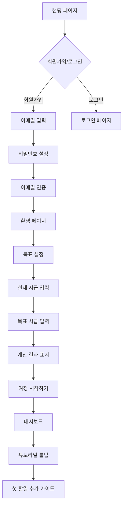
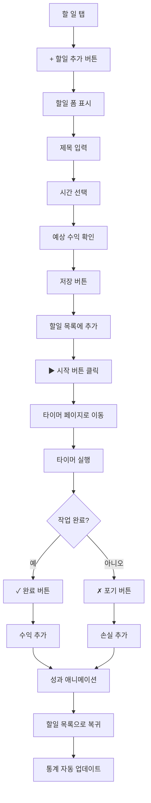
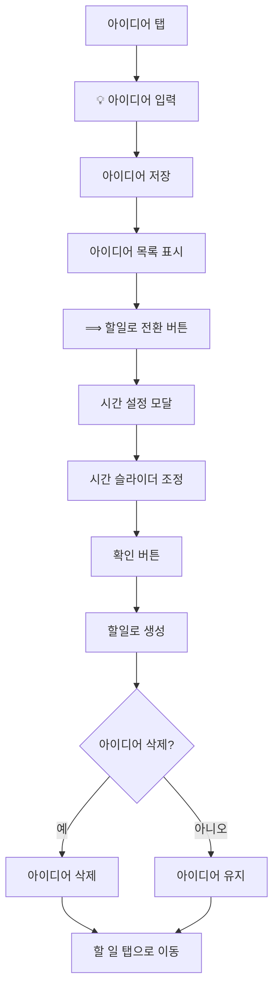
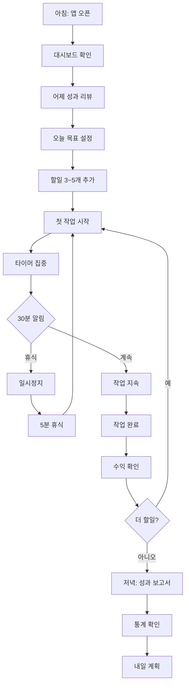

# Information Architecture (IA)
# 천억부자 타이머 (Billionaire Timer)

**문서 버전**: 2.0
**최종 수정일**: 2025-10-30
**작성자**: UX/Product Team
**상태**: In Development

---

## 📋 목차

1. [IA 개요](#1-ia-개요)
2. [사이트맵](#2-사이트맵)
3. [내비게이션 구조](#3-내비게이션-구조)
4. [페이지 구조](#4-페이지-구조)
5. [사용자 플로우](#5-사용자-플로우)
6. [콘텐츠 전략](#6-콘텐츠-전략)
7. [정보 계층](#7-정보-계층)
8. [검색 & 필터](#8-검색--필터)
9. [상태 관리](#9-상태-관리)
10. [반응형 레이아웃](#10-반응형-레이아웃)

---

## 1. IA 개요

### 1.1 IA 원칙

#### 1️⃣ 단순성 (Simplicity)
- 최소 클릭으로 핵심 기능 접근
- 명확한 정보 계층
- 불필요한 요소 제거

#### 2️⃣ 일관성 (Consistency)
- 전체 앱에서 동일한 패턴
- 예측 가능한 인터랙션
- 통일된 용어 사용

#### 3️⃣ 명확성 (Clarity)
- 직관적인 레이블
- 시각적 계층 구조
- 즉각적인 피드백

#### 4️⃣ 효율성 (Efficiency)
- 빠른 작업 완료
- 키보드 단축키 지원
- 스마트 기본값

### 1.2 정보 구조 원칙

```
[목표 지향]
모든 기능은 사용자의 목표 달성을 지원
   ↓
[액션 중심]
정보보다 액션 우선 (예: "시작하기", "완료")
   ↓
[실시간 피드백]
모든 액션에 즉각적인 시각적 피드백
   ↓
[진행 상황 표시]
현재 위치와 목표까지의 진행률 항상 표시
```

---

## 2. 사이트맵

### 2.1 현재 사이트맵 (v1.0 - 단일 페이지)

```
/ (index.html)
├── 목표 설정 모달
│   └── 목표 입력 폼
├── 메인 대시보드
│   ├── 헤더 (순수익, 연속 성공)
│   ├── 탭 네비게이션
│   │   ├── 목표
│   │   ├── 할 일
│   │   ├── 타이머
│   │   └── 아이디어
│   └── 메뉴 (설정)
├── 설정 오버레이
└── 성과 보고서 오버레이
```

### 2.2 목표 사이트맵 (v2.0 - Next.js)

```
/ (홈/랜딩)
│
├── /auth
│   ├── /login (로그인)
│   ├── /signup (회원가입)
│   └── /reset-password (비밀번호 재설정)
│
├── /onboarding (온보딩)
│   ├── /welcome
│   ├── /goals (목표 설정)
│   └── /tutorial
│
├── /dashboard (메인 대시보드) 🏠
│   ├── overview (오버뷰)
│   ├── progress (진행률)
│   └── missions (일일 미션)
│
├── /goals (목표 관리)
│   ├── /edit (목표 수정)
│   └── /history (목표 히스토리)
│
├── /todos (할일 관리)
│   ├── /new (새 할일)
│   ├── /[id] (할일 상세)
│   └── /[id]/edit (할일 수정)
│
├── /timer (타이머)
│   └── /[taskId] (특정 작업 타이머)
│
├── /ideas (아이디어)
│   └── /new (새 아이디어)
│
├── /stats (통계)
│   ├── /overview (통계 개요)
│   ├── /history (히스토리)
│   └── /reports (보고서)
│
├── /settings (설정)
│   ├── /profile (프로필)
│   ├── /preferences (환경설정)
│   ├── /notifications (알림)
│   └── /data (데이터 관리)
│
└── /help (도움말)
    ├── /faq
    └── /contact
```

### 2.3 URL 구조

| 페이지 | URL | 설명 |
|--------|-----|------|
| 홈 | `/` | 랜딩 페이지 |
| 대시보드 | `/dashboard` | 메인 대시보드 |
| 목표 설정 | `/goals/edit` | 목표 수정 |
| 할일 목록 | `/todos` | 전체 할일 |
| 할일 상세 | `/todos/[id]` | 특정 할일 상세 |
| 타이머 | `/timer/[taskId]` | 타이머 실행 |
| 아이디어 | `/ideas` | 아이디어 목록 |
| 통계 | `/stats` | 통계 대시보드 |
| 설정 | `/settings` | 설정 페이지 |

---

## 3. 내비게이션 구조

### 3.1 주 네비게이션 (Primary Navigation)

#### 모바일 (하단 탭)
```
┌────────────────────────────────┐
│        Content Area            │
└────────────────────────────────┘
┌────────────────────────────────┐
│  [🎯]  [☐]  [⏱️]  [💡]  [👤] │
│  목표  할일  타이머  아이디어  더보기 │
└────────────────────────────────┘
```

#### 데스크톱 (좌측 사이드바)
```
┌──────────┬──────────────────────┐
│  Logo    │      Header          │
├──────────┼──────────────────────┤
│ [🎯] 목표 │                      │
│ [☐] 할일  │                      │
│ [⏱️] 타이머│   Content Area       │
│ [💡] 아이디어                     │
│ [📊] 통계  │                      │
│          │                      │
│ [⚙️] 설정 │                      │
│ [?] 도움말│                      │
└──────────┴──────────────────────┘
```

### 3.2 보조 네비게이션 (Secondary Navigation)

#### 헤더 (Header)
```
┌────────────────────────────────────────────┐
│ [Logo]              [₩순수익] [🔥연속] [👤] │
└────────────────────────────────────────────┘
```

#### 사용자 메뉴 (User Menu)
```
[👤] 클릭 시 드롭다운
├── 프로필
├── 설정
├── 도움말
└── 로그아웃
```

### 3.3 컨텍스트 네비게이션 (Contextual Navigation)

#### 할일 카드 액션
```
[할일 카드]
├── ▶ 시작
├── ✎ 수정
├── ⌫ 삭제
└── ⋯ 더보기
    ├── 복제
    ├── 이동
    └── 보관
```

#### 타이머 액션
```
[타이머 실행 중]
├── ⏸ 일시정지
├── ⏹ 중단
└── 완료 액션
    ├── ✓ 완료
    └── ✗ 포기
```

---

## 4. 페이지 구조

### 4.1 대시보드 (Dashboard)

#### 레이아웃
```
┌─────────────────────────────────────────┐
│ Header                                  │
│ [순수익: ₩123,456] [연속: 🔥 7일]       │
├─────────────────────────────────────────┤
│ 목표 카드                                │
│ ┌─────────────────────────────────────┐ │
│ │ 현재 시급: ₩50,000 → 목표: ₩100,000 │ │
│ │ [━━━━━━━━━━⚬─────────] 65%         │ │
│ │ 일일 필요 시간: 4시간                │ │
│ └─────────────────────────────────────┘ │
├─────────────────────────────────────────┤
│ 오늘의 미션                             │
│ [ ] 작업 3개 완료하기                   │
│ [ ] 120분 집중하기                      │
│ [✓] 연속 성공 기록 유지                 │
├─────────────────────────────────────────┤
│ 빠른 액션                               │
│ [+ 할일 추가] [⏱️ 타이머 시작]          │
├─────────────────────────────────────────┤
│ 최근 활동                               │
│ • 30분 전: "디자인 작업" 완료 (+₩25,000)│
│ • 2시간 전: "미팅 준비" 완료 (+₩50,000) │
└─────────────────────────────────────────┘
│ Navigation                              │
└─────────────────────────────────────────┘
```

### 4.2 할일 페이지 (Todos)

#### 레이아웃
```
┌─────────────────────────────────────────┐
│ Header                                  │
│ [할 일] [검색] [필터] [+ 추가]          │
├─────────────────────────────────────────┤
│ 필터 & 정렬                             │
│ [전체] [대기] [진행중] [완료]           │
│ 정렬: [최신순 ▼]                        │
├─────────────────────────────────────────┤
│ 할일 목록                               │
│ ┌─────────────────────────────────────┐ │
│ │ ☐ 디자인 시안 완성                  │ │
│ │    60분 · 예상 수익 ₩50,000         │ │
│ │    [▶ 시작]                         │ │
│ └─────────────────────────────────────┘ │
│ ┌─────────────────────────────────────┐ │
│ │ ☐ 클라이언트 미팅                   │ │
│ │    30분 · 예상 수익 ₩25,000         │ │
│ │    [▶ 시작]                         │ │
│ └─────────────────────────────────────┘ │
│ ┌─────────────────────────────────────┐ │
│ │ ⏳ 코드 리뷰 (진행중)                │ │
│ │    45분 · 남은 시간 23:15           │ │
│ │    [⏸ 일시정지]                     │ │
│ └─────────────────────────────────────┘ │
└─────────────────────────────────────────┘
│ Navigation                              │
└─────────────────────────────────────────┘
```

### 4.3 타이머 페이지 (Timer)

#### 레이아웃
```
┌─────────────────────────────────────────┐
│ [← 뒤로]              [⋯ 메뉴]          │
├─────────────────────────────────────────┤
│                                         │
│      디자인 시안 완성                    │
│                                         │
│          ┌────────────┐                 │
│          │            │                 │
│          │   23:45    │  (큰 타이머)    │
│          │            │                 │
│          └────────────┘                 │
│                                         │
│     [━━━━━━━━━━━━━━⚬─] 75%            │
│                                         │
│     경과: 45분 / 총: 60분                │
│                                         │
│     예상 수익: ₩50,000                  │
│                                         │
├─────────────────────────────────────────┤
│  [⏸ 일시정지]  [⏹ 중단]                │
├─────────────────────────────────────────┤
│             완료 시:                    │
│      [✓ 완료]     [✗ 포기]             │
└─────────────────────────────────────────┘
```

### 4.4 아이디어 페이지 (Ideas)

#### 레이아웃
```
┌─────────────────────────────────────────┐
│ Header                                  │
│ [아이디어] [+ 추가]                     │
├─────────────────────────────────────────┤
│ 빠른 추가                               │
│ [                아이디어 입력...      ]│
│                             [💡 추가]   │
├─────────────────────────────────────────┤
│ 아이디어 목록                           │
│ ┌─────────────────────────────────────┐ │
│ │ 💡 새로운 랜딩페이지 디자인          │ │
│ │    2시간 전                          │ │
│ │    [⟹ 할일로 전환]  [⌫]            │ │
│ └─────────────────────────────────────┘ │
│ ┌─────────────────────────────────────┐ │
│ │ 💡 블로그 포스트 주제 10개           │ │
│ │    5시간 전                          │ │
│ │    [⟹ 할일로 전환]  [⌫]            │ │
│ └─────────────────────────────────────┘ │
└─────────────────────────────────────────┘
│ Navigation                              │
└─────────────────────────────────────────┘
```

### 4.5 통계 페이지 (Stats)

#### 레이아웃
```
┌─────────────────────────────────────────┐
│ Header                                  │
│ [통계] [기간: 이번 주 ▼] [📊 보고서]   │
├─────────────────────────────────────────┤
│ 주요 지표                               │
│ ┌──────────┬──────────┬──────────────┐  │
│ │ 총 수익  │ 총 손실  │ 순수익       │  │
│ │ ₩350,000│ ₩50,000 │ ₩300,000     │  │
│ └──────────┴──────────┴──────────────┘  │
│ ┌──────────┬──────────┬──────────────┐  │
│ │ 완료작업 │ 집중시간 │ 연속성공     │  │
│ │ 15개     │ 12시간   │ 🔥 7일       │  │
│ └──────────┴──────────┴──────────────┘  │
├─────────────────────────────────────────┤
│ 일주일 수익 추이                        │
│ [막대 차트]                             │
│ ▅▇█▅▆▇█                                │
│ 월화수목금토일                          │
├─────────────────────────────────────────┤
│ 작업 완료율                             │
│ [도넛 차트]                             │
│   완료 80%                              │
│   포기 20%                              │
├─────────────────────────────────────────┤
│ 최근 완료 작업                          │
│ • 디자인 작업 (+₩50,000)                │
│ • 코드 리뷰 (+₩25,000)                  │
│ • 미팅 준비 (+₩50,000)                  │
└─────────────────────────────────────────┘
│ Navigation                              │
└─────────────────────────────────────────┘
```

### 4.6 설정 페이지 (Settings)

#### 레이아웃
```
┌─────────────────────────────────────────┐
│ Header                                  │
│ [설정]                                  │
├─────────────────────────────────────────┤
│ 프로필                                  │
│ ┌─────────────────────────────────────┐ │
│ │ [사진] 김성장                        │ │
│ │ user@example.com                    │ │
│ │ [프로필 수정]                        │ │
│ └─────────────────────────────────────┘ │
├─────────────────────────────────────────┤
│ 환경설정                                │
│ ┌─────────────────────────────────────┐ │
│ │ 손실 표시              [●──] ON     │ │
│ │ 방해 사이트 경고       [●──] ON     │ │
│ │ 알림                   [●──] ON     │ │
│ │ 사운드/진동            [●──] ON     │ │
│ │ 성장 동기 배너         [●──] ON     │ │
│ │ 자동 재배치            [──●] OFF    │ │
│ └─────────────────────────────────────┘ │
├─────────────────────────────────────────┤
│ 집중 효율                               │
│ ┌─────────────────────────────────────┐ │
│ │ [──────⚬──────] 70%                 │ │
│ │ 작업 시간의 70%가 실제 수익으로     │ │
│ └─────────────────────────────────────┘ │
├─────────────────────────────────────────┤
│ 데이터                                  │
│ [데이터 내보내기] [데이터 초기화]       │
└─────────────────────────────────────────┘
│ Navigation                              │
└─────────────────────────────────────────┘
```

---

## 5. 사용자 플로우

### 5.1 신규 사용자 온보딩 플로우



### 5.2 할일 생성 → 완료 플로우



### 5.3 아이디어 → 할일 전환 플로우



### 5.4 일일 루틴 플로우



---

## 6. 콘텐츠 전략

### 6.1 콘텐츠 우선순위

#### 1차 정보 (Primary)
- **순수익**: 항상 헤더에 표시
- **연속 성공**: 동기부여 핵심 지표
- **현재 작업**: 타이머 실행 중일 때

#### 2차 정보 (Secondary)
- **일일 미션**: 대시보드 중앙
- **목표 진행률**: 시각적 프로그레스 바
- **빠른 액션**: CTA 버튼

#### 3차 정보 (Tertiary)
- **최근 활동**: 타임라인
- **성과 그래프**: 통계 페이지
- **도움말/팁**: 컨텍스트 기반

### 6.2 마이크로카피 (Microcopy)

#### 버튼 레이블
| 액션 | 레이블 | 설명 |
|------|--------|------|
| 시작 | "▶ 시작" | 타이머 시작 |
| 일시정지 | "⏸ 일시정지" | 타이머 일시정지 |
| 완료 | "✓ 완료" | 작업 완료 |
| 포기 | "✗ 포기" | 작업 포기 |
| 저장 | "저장" | 데이터 저장 |
| 취소 | "취소" | 액션 취소 |

#### 상태 메시지
| 상태 | 메시지 | 톤 |
|------|--------|-----|
| 성공 | "완료했습니다! 🎉" | 축하 |
| 에러 | "문제가 발생했습니다." | 중립 |
| 경고 | "정말 삭제하시겠습니까?" | 주의 |
| 정보 | "타이머가 시작되었습니다." | 안내 |

#### 빈 상태 (Empty State)
| 페이지 | 메시지 | CTA |
|--------|--------|-----|
| 할일 | "아직 할 일이 없습니다.\n첫 작업을 추가해볼까요?" | [+ 할일 추가] |
| 아이디어 | "떠오르는 아이디어를 적어보세요.\n나중에 할일로 만들 수 있습니다." | [💡 아이디어 추가] |
| 통계 | "아직 완료한 작업이 없습니다.\n첫 작업을 완료하고 성과를 확인하세요!" | [할 일 보기] |

#### 동기부여 메시지 (주간별)
```javascript
const motivations = [
  "월요일: 새로운 한 주, 새로운 시작! 💪",
  "화요일: 어제보다 더 나은 오늘을 만들어요! 🔥",
  "수요일: 한 주의 중간, 페이스를 유지하세요! ⚡",
  "목요일: 거의 다 왔어요. 조금만 더! 🚀",
  "금요일: 한 주를 멋지게 마무리해봐요! ✨",
  "토요일: 주말에도 성장하는 당신, 대단해요! 🌟",
  "일요일: 휴식과 계획의 날, 내일을 준비해요! 📝"
];
```

### 6.3 오류 메시지

#### 사용자 친화적 오류 메시지
| 오류 | 기술 메시지 | 사용자 메시지 | 해결 방법 |
|------|-------------|---------------|-----------|
| 네트워크 오류 | `Network Error` | "인터넷 연결을 확인해주세요." | "Wi-Fi나 데이터를 확인 후 다시 시도" |
| 인증 만료 | `401 Unauthorized` | "다시 로그인해주세요." | [로그인] 버튼 |
| 데이터 없음 | `404 Not Found` | "항목을 찾을 수 없습니다." | 목록으로 돌아가기 |
| 서버 오류 | `500 Internal Error` | "일시적인 문제가 발생했습니다.\n잠시 후 다시 시도해주세요." | 자동 재시도 |

---

## 7. 정보 계층

### 7.1 시각적 계층 (Visual Hierarchy)

```
Level 1: 헤더 & 주요 지표
  ├─ 순수익 (금색, 큰 글씨)
  └─ 연속 성공 (빨강/주황, 아이콘)

Level 2: 핵심 콘텐츠
  ├─ 목표 카드 (강조된 카드)
  ├─ 할일 목록 (스크롤 가능)
  └─ 타이머 디스플레이 (전체 화면)

Level 3: 보조 정보
  ├─ 일일 미션 (작은 카드)
  ├─ 최근 활동 (타임라인)
  └─ 동기부여 배너 (하단)

Level 4: 메타 정보
  ├─ 타임스탬프
  ├─ 카테고리
  └─ 태그
```

### 7.2 정보 밀도 (Information Density)

#### 모바일 (Low Density)
- 한 화면에 1~2개의 주요 정보
- 큰 터치 영역 (최소 44×44px)
- 넉넉한 여백

#### 태블릿 (Medium Density)
- 한 화면에 2~4개의 카드
- 2단 레이아웃
- 중간 여백

#### 데스크톱 (High Density)
- 한 화면에 다중 패널
- 3단 레이아웃
- 효율적인 공간 활용

---

## 8. 검색 & 필터

### 8.1 할일 필터링

#### 필터 옵션
```typescript
interface TodoFilter {
  status: 'all' | 'pending' | 'running' | 'completed' | 'abandoned';
  sortBy: 'created' | 'time' | 'profit' | 'title';
  sortOrder: 'asc' | 'desc';
  search?: string;
}
```

#### UI 구현
```
[전체] [대기 중] [진행 중] [완료]
             └─ 활성 필터 표시 (밑줄/하이라이트)

정렬: [최신순 ▼]
      └─ 드롭다운 메뉴
          ├─ 최신순
          ├─ 오래된 순
          ├─ 시간 많은 순
          └─ 수익 높은 순
```

### 8.2 통계 기간 필터

```
기간: [이번 주 ▼]
      └─ 드롭다운 메뉴
          ├─ 오늘
          ├─ 어제
          ├─ 이번 주
          ├─ 지난 주
          ├─ 이번 달
          ├─ 지난 달
          └─ 사용자 지정
```

### 8.3 검색 (v2.0+)

#### 전역 검색
```
[🔍 검색...]
    └─ 입력 시 자동완성
        ├─ 할일 제목
        ├─ 아이디어 내용
        └─ 최근 검색어
```

---

## 9. 상태 관리

### 9.1 페이지 상태

#### 로딩 상태
```
[스켈레톤 UI]
┌─────────────────┐
│ ████████████    │ (제목 placeholder)
│ ████            │ (부제 placeholder)
│ [───────]       │ (버튼 placeholder)
└─────────────────┘
```

#### 빈 상태
```
[일러스트]
    📭
"아직 항목이 없습니다."
  [+ 추가하기]
```

#### 에러 상태
```
[아이콘]
    ⚠️
"문제가 발생했습니다."
  [다시 시도]
```

### 9.2 인터랙션 상태

#### 버튼 상태
```css
/* 기본 */
.button { background: gold; }

/* 호버 */
.button:hover { background: darkgold; transform: scale(1.05); }

/* 활성 */
.button:active { transform: scale(0.95); }

/* 비활성 */
.button:disabled { opacity: 0.5; cursor: not-allowed; }

/* 로딩 */
.button.loading { cursor: wait; }
.button.loading::after { content: "..."; animation: dots; }
```

---

## 10. 반응형 레이아웃

### 10.1 브레이크포인트

```css
/* Mobile First */
/* xs: 0~639px (기본) */
.container { width: 100%; padding: 16px; }

/* sm: 640px+ (큰 모바일) */
@media (min-width: 640px) {
  .container { padding: 20px; }
}

/* md: 768px+ (태블릿) */
@media (min-width: 768px) {
  .container { max-width: 768px; }
  .grid { grid-template-columns: repeat(2, 1fr); }
}

/* lg: 1024px+ (데스크톱) */
@media (min-width: 1024px) {
  .container { max-width: 1024px; }
  .grid { grid-template-columns: repeat(3, 1fr); }
  .sidebar { display: block; }
}

/* xl: 1280px+ (큰 데스크톱) */
@media (min-width: 1280px) {
  .container { max-width: 1280px; }
}
```

### 10.2 레이아웃 변환

#### 모바일 (< 768px)
```
┌────────────────┐
│    Header      │
├────────────────┤
│                │
│    Content     │
│    (Stack)     │
│                │
├────────────────┤
│   Navigation   │
└────────────────┘
```

#### 태블릿 (768px ~ 1023px)
```
┌─────────────────────────┐
│        Header           │
├─────────────────────────┤
│ ┌─────────┬───────────┐ │
│ │ Content │  Content  │ │
│ │  (50%)  │   (50%)   │ │
│ └─────────┴───────────┘ │
├─────────────────────────┤
│      Navigation         │
└─────────────────────────┘
```

#### 데스크톱 (1024px+)
```
┌───────┬─────────────────────┐
│       │      Header         │
│  Nav  ├─────────────────────┤
│ (240) │ ┌──────┬──────┬───┐ │
│       │ │Content Content C│ │
│       │ │ (33%) (33%) (33%)│ │
│       │ └──────┴──────┴───┘ │
└───────┴─────────────────────┘
```

### 10.3 적응형 컴포넌트

#### 할일 카드
```
Mobile:
┌──────────────────┐
│ ☐ 디자인 작업    │
│ 60분 · ₩50,000   │
│ [▶ 시작]         │
└──────────────────┘

Desktop:
┌────────────────────────────────┐
│ ☐ 디자인 작업  60분 · ₩50,000  │
│                  [▶ 시작] [⋯]  │
└────────────────────────────────┘
```

---

## 부록

### A. IA 체크리스트

#### 정보 구조
- [ ] 사이트맵 명확
- [ ] URL 구조 일관성
- [ ] 정보 계층 3단계 이내
- [ ] 모든 페이지 3클릭 이내 접근

#### 내비게이션
- [ ] 주 네비게이션 5~7개 항목
- [ ] 현재 위치 표시 (Breadcrumb)
- [ ] 모바일 네비게이션 최적화
- [ ] 키보드 네비게이션 지원

#### 콘텐츠
- [ ] 명확한 헤딩 구조
- [ ] 스캔 가능한 레이아웃
- [ ] 일관된 용어 사용
- [ ] 액션 지향적 레이블

#### 검색 & 필터
- [ ] 검색 결과 관련성
- [ ] 필터 조합 가능
- [ ] 빠른 필터 접근
- [ ] 검색어 자동완성

#### 반응형
- [ ] 모든 브레이크포인트 테스트
- [ ] 터치 영역 충분
- [ ] 가독성 유지
- [ ] 성능 최적화

### B. IA 테스트

#### Card Sorting
- 사용자에게 기능 카드를 그룹화하도록 요청
- 결과를 통해 직관적인 카테고리 도출

#### Tree Testing
- 사이트맵을 보지 않고 특정 정보 찾기 테스트
- 성공률 80% 이상 목표

#### Usability Testing
- 5명의 사용자로 주요 플로우 테스트
- 막히는 지점 파악 및 개선

### C. 참고 자료
- [IA Institute](https://www.iainstitute.org/)
- [Nielsen Norman Group - IA](https://www.nngroup.com/topic/information-architecture/)
- [Optimal Workshop](https://www.optimalworkshop.com/) (Card Sorting 도구)

### D. 변경 이력
| 버전 | 날짜 | 변경 사항 |
|------|------|----------|
| 1.0 | 2025-09-01 | 초기 문서 작성 |
| 2.0 | 2025-10-30 | Next.js 마이그레이션 사이트맵 추가 |

---

**문서 승인**:
- [ ] UX Designer
- [ ] Product Manager
- [ ] Frontend Engineer
- [ ] QA Lead
